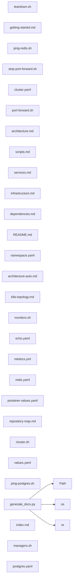

# Dependency Graph

```mermaid
graph LR
teardown_sh["teardown.sh"]
getting_started_md["getting-started.md"]
ping_redis_sh["ping-redis.sh"]
stop_port_forward_sh["stop-port-forward.sh"]
cluster_yaml["cluster.yaml"]
port_forward_sh["port-forward.sh"]
architecture_md["architecture.md"]
scripts_md["scripts.md"]
services_md["services.md"]
infrastructure_md["infrastructure.md"]
dependencies_md["dependencies.md"]
README_md["README.md"]
Path["Path"]
namespace_yaml["namespace.yaml"]
architecture_auto_md["architecture-auto.md"]
k8s_topology_md["k8s-topology.md"]
monitors_sh["monitors.sh"]
re["re"]
echo_yaml["echo.yaml"]
mkdocs_yml["mkdocs.yml"]
os["os"]
redis_yaml["redis.yaml"]
portainer_values_yaml["portainer-values.yaml"]
repository_map_md["repository-map.md"]
cluster_sh["cluster.sh"]
values_yaml["values.yaml"]
ping_postgres_sh["ping-postgres.sh"]
generate_docs_py["generate_docs.py"]
index_md["index.md"]
managers_sh["managers.sh"]
postgres_yaml["postgres.yaml"]
generate_docs_py --> Path
generate_docs_py --> os
generate_docs_py --> re
```