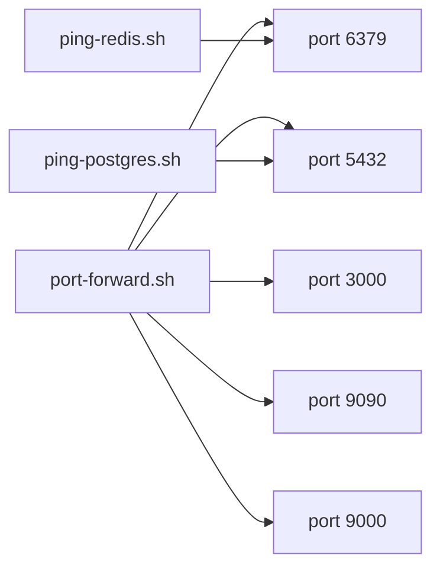

# Service Interaction Map

```mermaid
graph LR
ping_redis_sh["ping-redis.sh"]
port_5432["port 5432"]
port_6379["port 6379"]
ping_postgres_sh["ping-postgres.sh"]
port_9090["port 9090"]
port_3000["port 3000"]
port_9000["port 9000"]
port_forward_sh["port-forward.sh"]
port_forward_sh --> port_3000
port_forward_sh --> port_9090
port_forward_sh --> port_9000
port_forward_sh --> port_6379
port_forward_sh --> port_5432
ping_redis_sh --> port_6379
ping_postgres_sh --> port_5432
```